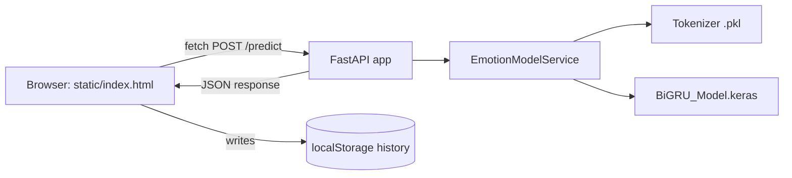
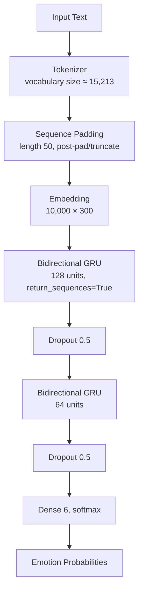

# NeuroSense — AI Emotion Intelligence Platform

An NLP-powered emotion intelligence platform built around a trained **Bidirectional GRU** neural network. NeuroSense takes a sentence, runs it through the model, and returns a full probability distribution across six emotions — visualized as a confidence gauge, probability bars, a radar chart, and a live inference pipeline.

## Overview

- **Backend**: FastAPI serving a pre-trained BiGRU model (TensorFlow / Keras)
- **Frontend**: A single-page vanilla JS/HTML/CSS app with a dark, AI-lab visual identity
- **Storage**: Prediction history lives in the browser's `localStorage` (structured so a real database can be swapped in later — see [Future Improvements](#future-improvements))
- **Model**: Not retrained or modified — this project wraps and productizes an existing trained model

🚀 Live Demo
🌐 Try NeuroSense

🔗 Live Application — neuro-sense.onrender.com

The application is deployed with FastAPI and serves the frontend directly from the backend.

💻 Source Code

🔗 GitHub Repository — NeuroSense
## 🖥️ Screenshots


## Features

- Six-class emotion classification (sadness, joy, love, anger, fear, surprise) with full probability breakdown
- Animated confidence gauge and probability bars
- Emotion radar chart, updated per prediction
- Animated inference-pipeline visualization (tokenize → embed → BiGRU → dense → probabilities)
- Prediction history (local, timestamped, grouped by day)
- Analytics dashboard computed entirely from real prediction history (no hardcoded numbers)
- Model information page with architecture and parameters read live from the loaded model
- Clickable sample prompts, responsive layout, graceful error and empty states

## Architecture



## Model Architecture

Read directly from the loaded model (`backend/services/model_service.py::get_model_info`) — nothing below is invented:



Trainable parameters: **3,454,662**. Loss: `sparse_categorical_crossentropy`, optimizer: `Adam`.

## NLP Pipeline

1. Lowercase the input text
2. Strip apostrophes (`can't` → `cant`)
3. Strip punctuation / non-alphanumeric characters
4. Collapse whitespace
5. Tokenize with the fitted Keras `Tokenizer`
6. Post-pad/truncate to length 50
7. Run through the BiGRU model to get a softmax distribution over 6 classes

This is unchanged from the original implementation — only reorganized into `services/model_service.py`.

## Tech Stack

| Layer | Technology |
|---|---|
| Model | TensorFlow / Keras, Bidirectional GRU |
| API | FastAPI, Pydantic v2 |
| Frontend | Vanilla HTML/CSS/JS (no build step) |
| Storage | Browser `localStorage` (swappable for a real DB) |

## API Endpoints

| Method | Path | Description |
|---|---|---|
| `GET` | `/` | Serves the frontend |
| `GET` | `/health` | Server + model load status |
| `POST` | `/predict` | Runs inference on a text input |
| `GET` | `/model-info` | Live-introspected model architecture and parameters |
| `GET` | `/stats` | Runtime prediction counters (server-side, resets on restart) |

`POST /predict` request/response:

```json
// Request
{ "text": "I just got selected for my dream internship!" }

// Response
{
  "text": "I just got selected for my dream internship!",
  "cleaned_text": "i just got selected for my dream internship",
  "predicted_emotion": "joy",
  "emoji": "😄",
  "confidence": 0.87,
  "all_probabilities": { "sadness": 0.02, "joy": 0.87, "love": 0.05, "anger": 0.01, "fear": 0.03, "surprise": 0.02 },
  "inference_time_ms": 42.1
}
```

## Project Structure

```
├── backend/
│   ├── main.py                # FastAPI app, routes
│   ├── config.py               # Env-driven settings, robust paths, constants
│   ├── schemas.py               # Pydantic request/response models
│   └── services/
│       └── model_service.py    # Wraps the trained BiGRU model + tokenizer
├── Artifacts/
│   ├── BiGRU_Model.keras
│   └── tokenizer.pkl
├── static/
│   ├── index.html
│   ├── css/style.css
│   └── js/app.js
├── requirements.txt
├── runtime.txt
├── .env.example
└── README.md
```

## Installation

```bash
git clone <your-repo-url>
cd neurosense
python -m venv .venv
source .venv/bin/activate   # Windows: .venv\Scripts\activate
pip install -r requirements.txt
cp .env.example .env
```

## Running Locally

```bash
cd backend
uvicorn main:app --reload
```

Open `http://127.0.0.1:8000`.

## Deployment

- Set `ENVIRONMENT=production` and `CORS_ORIGINS` to your real frontend origin(s) — never `*` in production.
- Model and tokenizer paths are resolved relative to `backend/config.py`, not the working directory, so the app runs correctly regardless of where the process is started from.
- `runtime.txt` pins the Python version for platforms that read it (e.g. Heroku-style buildpacks); for Docker or other platforms, use it as a reference for your base image.
- Typical start command: `uvicorn backend.main:app --host 0.0.0.0 --port $PORT`

## Example Prediction

> Input: `"I feel completely exhausted today."`
> Predicted: `sadness`

> Input: `"I really love spending time with my family."`
> Predicted emotion depends on the trained model's actual weights — see the Analyze page for live results and the full probability breakdown, since exact figures vary by model checkpoint. This project does not display invented example numbers.

## Model Limitations

- Trained on 6 discrete emotion classes; nuanced or mixed emotions are forced into the closest single label.
- Confidence reflects the model's softmax output, not a validated measure of certainty — treat it as relative, not absolute.
- This is a general-purpose emotion classifier, **not** a mental-health or psychological diagnostic tool, and should not be used as one.
- Accuracy/precision/recall/F1 figures are not included here because they were not available in the provided project artifacts. See below.

## Future Improvements

- Persist prediction history in a real database (schema already isolated behind `historyStore` in `app.js` for an easy swap)
- Add authentication if history needs to be user-specific rather than per-browser
- Publish evaluation metrics (accuracy, per-class F1, confusion matrix) once a held-out test set is run against the model
- Add batch/CSV upload for analyzing multiple texts at once
- Model explainability (e.g. attention/saliency over tokens) if the training pipeline is extended to support it
